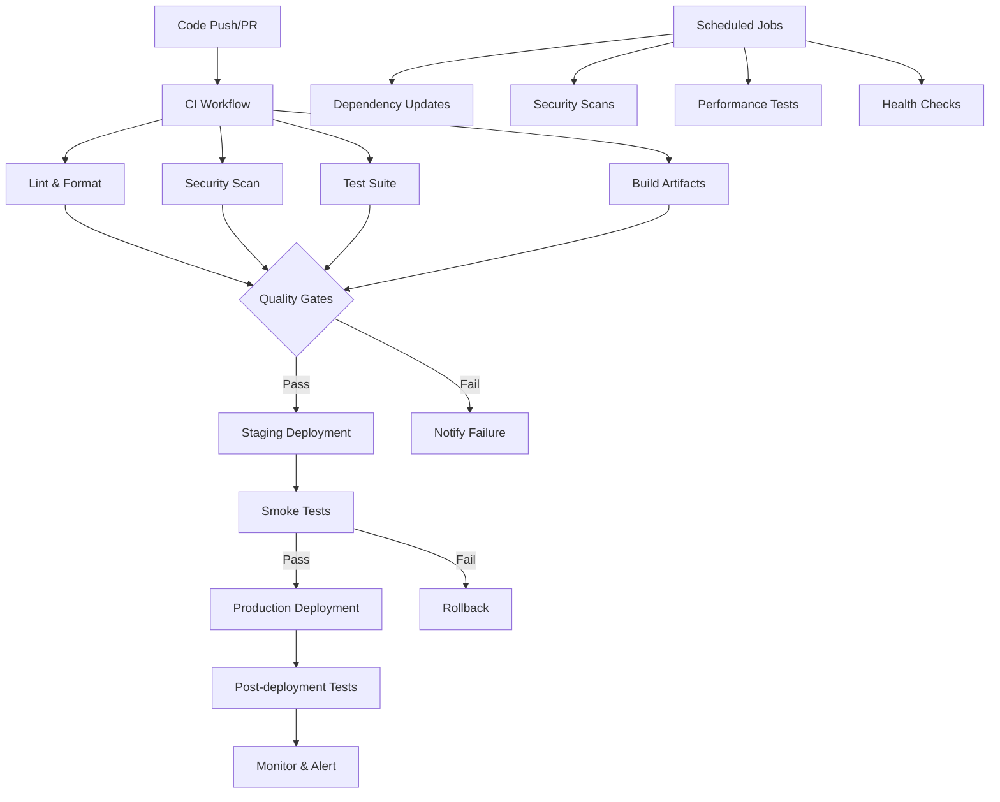

# CI/CD Pipeline Documentation

This document provides comprehensive documentation for the CI/CD pipeline of the Statecharts project, including setup, configuration, workflows, and maintenance procedures.

## Table of Contents

1. [Overview](#overview)
2. [Pipeline Architecture](#pipeline-architecture)
3. [Workflows](#workflows)
4. [Configuration Files](#configuration-files)
5. [Scripts and Tools](#scripts-and-tools)
6. [Monitoring and Alerts](#monitoring-and-alerts)
7. [Security and Compliance](#security-and-compliance)
8. [Deployment Strategies](#deployment-strategies)
9. [Troubleshooting](#troubleshooting)
10. [Maintenance](#maintenance)

## Overview

The Statecharts project uses a comprehensive CI/CD pipeline built on GitHub Actions that supports:

- **Multi-language codebase**: Go (core), Python SDK, Rust SDK, JavaScript (web UI)
- **Automated testing**: Unit, integration, end-to-end, and performance tests
- **Code quality**: Linting, formatting, security scanning, and compliance checks
- **Automated deployments**: Staging and production environments
- **Monitoring**: Health checks, performance monitoring, and alerting
- **Release automation**: Semantic versioning and multi-platform releases

## Pipeline Architecture



## Workflows

### 1. Continuous Integration (CI) - `.github/workflows/ci.yml`

**Triggers**: Push to `main`/`develop`, Pull Requests

**Jobs**:
- **Lint and Format**: Code quality checks across all languages
- **Security Scan**: Vulnerability and secret scanning
- **Test Matrix**: 
  - Go tests (Ubuntu, macOS, Windows)
  - Python tests (versions 3.8-3.12)
  - Rust tests
  - JavaScript/Web tests
- **Performance**: Benchmark tests and profiling
- **Docker**: Container builds and tests
- **Integration**: Cross-component testing

**Key Features**:
- Parallel execution for faster feedback
- Matrix builds across platforms and versions
- Comprehensive test coverage reporting
- Artifact generation for debugging

### 2. Continuous Deployment (CD) - `.github/workflows/cd.yml`

**Triggers**: 
- Push to `main` (staging deployment)
- Git tags `v*` (production deployment)
- Manual dispatch

**Jobs**:
- **Build Images**: Multi-architecture Docker images
- **Deploy Staging**: Automated staging deployment
- **Deploy Production**: Tagged release deployment
- **Publish SDKs**: Language-specific package registries
- **Create Release**: GitHub release with artifacts

**Deployment Strategy**:
- Blue-green deployment for zero downtime
- Automatic rollback on failure
- Comprehensive smoke testing

### 3. Security Scanning - `.github/workflows/security.yml`

**Triggers**: 
- Push/PR to main branches
- Weekly scheduled scan
- Manual dispatch

**Security Tools**:
- **CodeQL**: Static analysis for Go, Python, JavaScript
- **Dependency Check**: OWASP vulnerability database
- **Container Scanning**: Trivy and Grype
- **License Compliance**: FOSSA integration
- **Secret Scanning**: Gitleaks and TruffleHog
- **SAST**: Semgrep for comprehensive static analysis
- **IaC Scanning**: Checkov for infrastructure

### 4. Dependency Management - `.github/workflows/dependency-update.yml`

**Triggers**: Weekly scheduled run

**Features**:
- Automated dependency updates for all languages
- Security vulnerability patches
- Renovate bot integration
- Automated PR creation with test validation

### 5. Performance Monitoring - `.github/workflows/performance.yml`

**Triggers**: 
- Daily scheduled runs
- Push to main
- Manual dispatch

**Performance Tests**:
- Go benchmarks with trend analysis
- Load testing with k6
- Web performance with Lighthouse
- SDK performance across languages
- Regression detection with alerts

### 6. Health Monitoring - `.github/workflows/monitoring.yml`

**Triggers**: Every 15 minutes

**Monitoring**:
- API health checks
- Synthetic user journeys
- SSL certificate monitoring
- Performance metrics collection
- SLA compliance tracking
- Cost monitoring

### 7. Release Automation - `.github/workflows/release.yml`

**Triggers**: Manual dispatch with release type

**Features**:
- Semantic versioning
- Automated changelog generation
- Multi-platform binary builds
- Package publishing (PyPI, crates.io, npm)
- Docker image releases
- GitHub release creation

### 8. Docker CI/CD - `.github/workflows/docker-ci.yml`

**Features**:
- Multi-stage Docker builds
- Security scanning of images
- Registry publishing
- Container orchestration testing

## Configuration Files

### GitHub Actions Configuration

- **Dependabot**: `.github/dependabot.yml` - Automated dependency updates
- **Renovate**: `.github/renovate.json` - Advanced dependency management
- **Code Owners**: `.github/CODEOWNERS` - Code review assignments
- **Issue Templates**: `.github/ISSUE_TEMPLATE/` - Standardized issue reporting
- **PR Template**: `.github/pull_request_template.md` - Pull request guidelines

### Code Quality Configuration

- **Go Linting**: `.golangci.yml` - Comprehensive Go linting rules
- **Python**: `sdks/python/pyproject.toml` - Black, ruff, mypy configuration
- **Rust**: `sdks/rust/rustfmt.toml`, `clippy.toml` - Rust formatting and linting
- **JavaScript**: `cmd/web-visualizer/.eslintrc.js` - ESLint configuration

### CI/CD Makefiles

- **Main**: `Makefile` - Development and build tasks
- **CI/CD**: `Makefile.ci` - CI/CD specific operations
- **Docker**: `Makefile.docker` - Container operations

## Scripts and Tools

### Health Check Scripts

- **`scripts/health-check.sh`**: Comprehensive health verification
  - Multiple output formats (text, JSON, Prometheus)
  - Component-specific checks
  - Performance validation
  - Security header verification

### Smoke Testing

- **`scripts/smoke-test.sh`**: Post-deployment verification
  - API endpoint validation
  - Functional testing
  - Response time checks
  - WebSocket connectivity

### Load Testing

- **`scripts/load-tests/api-load-test.js`**: k6-based load testing
  - Realistic user scenarios
  - Performance thresholds
  - Custom metrics
  - Detailed reporting

### Deployment Verification

- **`scripts/deploy-verify.sh`**: Deployment success validation
  - Multi-environment support
  - Comprehensive verification
  - SSL certificate checking
  - Security validation

## Monitoring and Alerts

### Health Monitoring

- **Frequency**: Every 15 minutes
- **Endpoints**: API, web UI, health checks
- **Metrics**: Response time, availability, error rates
- **Alerting**: Slack, PagerDuty integration

### Performance Monitoring

- **Benchmarks**: Automated performance regression detection
- **Load Testing**: Regular capacity validation
- **Web Performance**: Lighthouse CI for frontend metrics
- **Infrastructure**: Resource utilization tracking

### Security Monitoring

- **Vulnerability Scanning**: Daily automated scans
- **Dependency Monitoring**: Real-time vulnerability alerts
- **Secret Scanning**: Continuous monitoring for exposed secrets
- **Compliance**: Automated compliance reporting

## Security and Compliance

### Security Measures

1. **Code Scanning**:
   - Static analysis with CodeQL
   - Dependency vulnerability checking
   - Secret detection
   - Container security scanning

2. **Access Control**:
   - Branch protection rules
   - Required reviews
   - Status checks
   - Restricted merging

3. **Secrets Management**:
   - GitHub Secrets for sensitive data
   - Rotation policies
   - Audit logging

### Compliance Features

- **SARIF reporting** for security findings
- **License compliance** checking
- **Audit trails** for all changes
- **Compliance reporting** automation

## Deployment Strategies

### Staging Environment

- **Trigger**: Every push to `main`
- **Purpose**: Integration testing and validation
- **Features**: Full feature set, realistic data
- **Validation**: Automated smoke tests

### Production Environment

- **Trigger**: Tagged releases
- **Strategy**: Blue-green deployment
- **Validation**: Health checks and smoke tests
- **Rollback**: Automatic on failure

### Release Process

1. **Preparation**: Automated version bumping and changelog
2. **Building**: Multi-platform artifacts
3. **Publishing**: Package registries and container registries
4. **Deployment**: Staged rollout with validation
5. **Monitoring**: Post-deployment health tracking

## Troubleshooting

### Common Issues

1. **Test Failures**:
   - Check test logs in Actions tab
   - Verify environment setup
   - Review dependency versions

2. **Build Failures**:
   - Check compilation errors
   - Verify tool versions
   - Review dependency conflicts

3. **Deployment Issues**:
   - Check deployment logs
   - Verify secrets and permissions
   - Review infrastructure status

4. **Security Scan Failures**:
   - Review SARIF reports
   - Update vulnerable dependencies
   - Address code security issues

### Debug Tools

- **Local CI simulation**: Use `act` to run Actions locally
- **Make targets**: Use `make ci-*` targets for local testing
- **Docker debugging**: Use development containers
- **Log analysis**: Centralized logging with structured output

### Recovery Procedures

1. **Rollback Deployment**:
   ```bash
   # Manual rollback to previous version
   kubectl rollout undo deployment/statecharts
   ```

2. **Emergency Fix**:
   ```bash
   # Hotfix process
   git checkout -b hotfix/critical-fix
   # Make fixes
   git push origin hotfix/critical-fix
   # Create PR with expedited review
   ```

## Maintenance

### Regular Tasks

1. **Weekly**:
   - Review dependency updates
   - Check security scan results
   - Monitor performance trends
   - Update documentation

2. **Monthly**:
   - Review and update CI/CD configurations
   - Analyze test coverage reports
   - Update security policies
   - Performance baseline review

3. **Quarterly**:
   - Tool version updates
   - Infrastructure optimization
   - Process improvement review
   - Disaster recovery testing

### Updating the Pipeline

1. **Workflow Changes**:
   - Test changes in feature branches
   - Use workflow dispatch for testing
   - Monitor first few runs closely

2. **Tool Updates**:
   - Test in development environment
   - Update documentation
   - Coordinate with team

3. **Configuration Updates**:
   - Validate syntax and logic
   - Test with sample repositories
   - Monitor for regressions

### Best Practices

1. **Keep workflows simple and focused**
2. **Use matrix builds for comprehensive testing**
3. **Implement proper error handling and notifications**
4. **Maintain comprehensive documentation**
5. **Regular security and performance reviews**
6. **Automate as much as possible**
7. **Monitor and improve continuously**

## Getting Help

- **Internal Documentation**: Check this file and inline comments
- **GitHub Actions Documentation**: https://docs.github.com/en/actions
- **Tool-specific Documentation**: Check individual tool websites
- **Team Contact**: Create issues or discussions in the repository

## Contributing to CI/CD

1. **Propose Changes**: Create issues for CI/CD improvements
2. **Test Changes**: Use feature branches and careful testing
3. **Document Updates**: Update this documentation
4. **Review Process**: All CI/CD changes require team review

---

This CI/CD pipeline is designed to be robust, secure, and maintainable. Regular reviews and updates ensure it continues to serve the project's needs effectively.