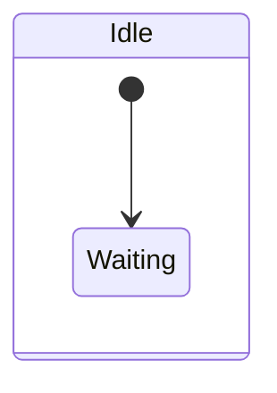
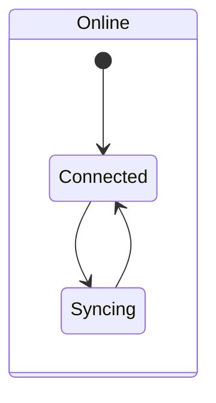
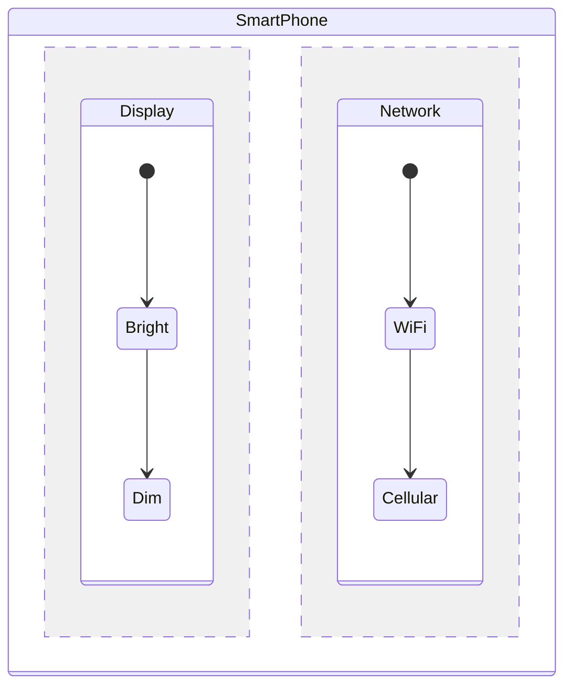
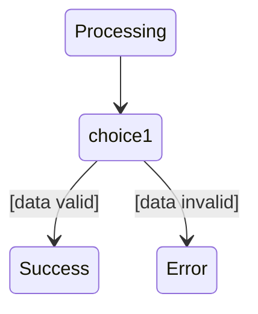
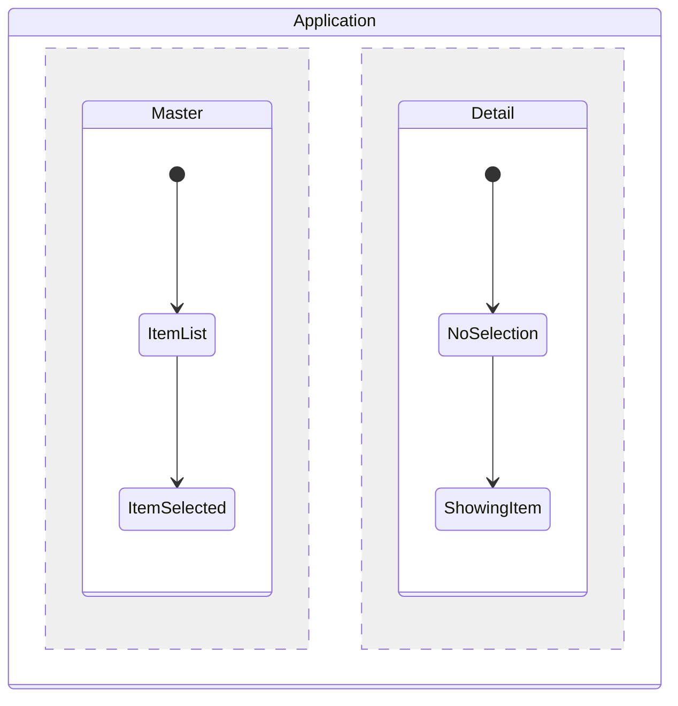
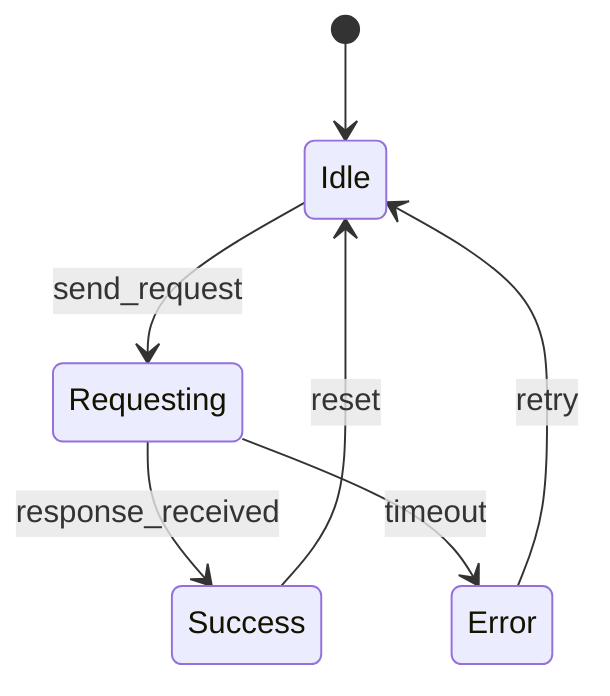
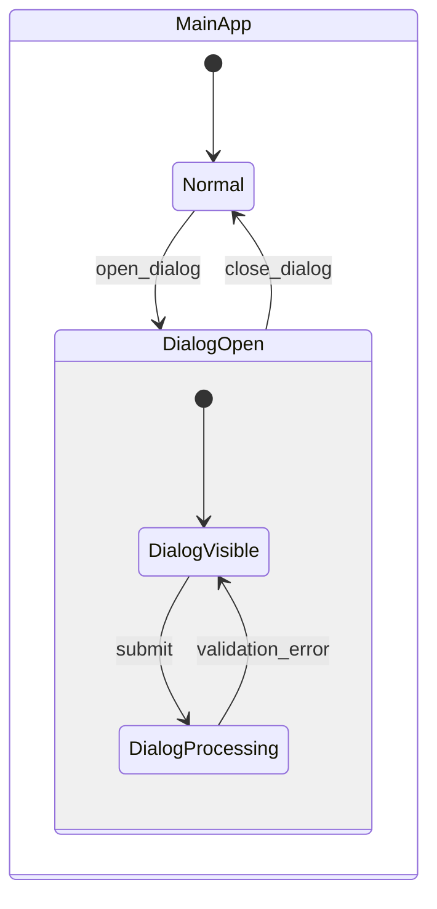
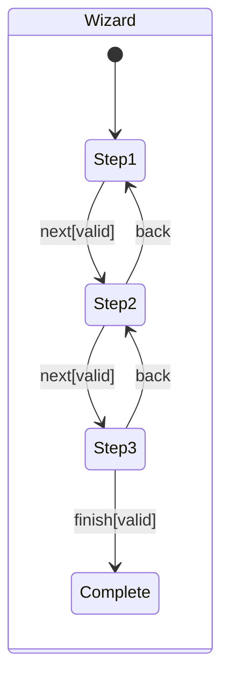

# Basic Concepts

Now that you've built your first statechart, let's dive deeper into the fundamental concepts that make statecharts powerful for modeling reactive systems.

## Core Elements

### 1. States

States represent the different conditions or situations your system can be in.

#### Types of States

**Basic State (Atomic)**
- Has no child states  
- Represents a simple condition
- Cannot be decomposed further



**Compound State (Hierarchical)**
- Contains child states
- Only one child can be active at a time (XOR semantics)
- Provides abstraction and organization



**Orthogonal State (Parallel)**
- Contains multiple child regions
- All regions are active simultaneously (AND semantics)
- Models concurrent behaviors



#### State Properties

- **Label**: Unique identifier within its parent
- **Initial**: Marks the default child state
- **Final**: Terminal state that signals completion
- **Type**: Defines the state's behavior (basic, compound, orthogonal)

### 2. Transitions

Transitions define how your system moves from one state to another.

#### Transition Anatomy

```
Source --[Event/Guard]/Action--> Target
```

- **Source**: Starting state(s)
- **Target**: Destination state(s)  
- **Event**: Trigger that causes the transition
- **Guard**: Optional condition that must be true
- **Action**: Optional side effect executed during transition

#### Transition Types

**Internal Transition**
- Processes an event without changing state
- Useful for handling events that don't cause state changes

**External Transition** 
- Changes from one state to another
- Most common type of transition

**Compound Transition**
- Involves multiple source or target states
- Enables complex state changes

### 3. Events

Events are the stimuli that drive state changes in your system.

#### Event Sources

**External Events**
- User input (button clicks, key presses)
- Network messages
- Sensor readings
- Timer expiration

**Internal Events**
- Completion events from child states
- Condition changes
- Calculated values reaching thresholds

#### Event Properties

- **Label**: Unique identifier for the event type
- **Data**: Optional payload carried with the event
- **Timestamp**: When the event occurred

### 4. Configuration

Configuration represents which states are currently active in your statechart.

#### Configuration Rules

**Hierarchical Consistency**
- If a child state is active, all its ancestors must be active
- Only one child of a compound state can be active

**Orthogonal Completeness**
- In orthogonal states, exactly one state from each region must be active

**Example Configuration**
```
Active States: [__root__, Device, Display, Bright, Network, WiFi]
```

This represents:
- Root state is active (always true)
- Device state is active
- Display region: Bright state is active
- Network region: WiFi state is active

## Advanced Concepts

### 5. History States

History states remember the last active configuration when re-entering a compound state.

**Shallow History**
- Remembers direct child state only

**Deep History**  
- Remembers entire nested configuration

```mermaid
stateDiagram-v2
    state MediaPlayer {
        [*] --> Stopped
        Stopped --> Playing
        Playing --> Paused
        
        state Playing {
            [*] --> NormalSpeed
            NormalSpeed --> FastForward
            FastForward --> NormalSpeed
            note right of History : Returns to last playback mode
        }
        
        Paused --> History : resume
    }
```

### 6. Entry and Exit Actions

States can have actions that execute when entering or leaving the state.

**Entry Actions**
- Execute when state becomes active
- Initialize resources, start timers, etc.

**Exit Actions**
- Execute when leaving the state  
- Clean up resources, save state, etc.

### 7. Internal Activities

Ongoing activities that occur while a state is active.

**Do Activities**
- Continuous operations during state activation
- Automatically terminate when state is exited

### 8. Conditional Logic

**Guards**
- Boolean conditions that control transition firing
- Must evaluate to true for transition to occur

**Choice Points**
- Dynamic conditional routing based on runtime conditions



## Design Principles

### 1. Hierarchy for Organization

Use hierarchical states to:
- Group related states
- Share common behavior
- Reduce complexity through abstraction
- Model natural containment relationships

### 2. Orthogonality for Independence

Use orthogonal states to:
- Model independent concurrent behaviors
- Avoid state explosion from cross-products
- Maintain separation of concerns
- Enable parallel execution

### 3. Communication for Coordination

Use events to:
- Decouple components
- Enable reactive behavior
- Coordinate between independent parts
- Handle asynchronous operations

## Common Patterns

### 1. Master-Detail Pattern



### 2. Request-Response Pattern



### 3. Modal Dialog Pattern



### 4. Wizard/Multi-Step Pattern



## Best Practices

### Naming Conventions

**States**
- Use descriptive, noun-based names
- PascalCase or snake_case consistently
- Avoid generic names like "State1"

**Events**  
- Use verb-based names describing actions
- UPPER_CASE for event constants
- Include context when needed

**Transitions**
- Descriptive labels explaining the change
- Include source context for clarity

### Organization

**Flat vs Hierarchical**
- Start flat, add hierarchy when patterns emerge
- Group states that share common behavior
- Use hierarchy to reduce duplication

**State Granularity**
- Each state should represent a meaningful system condition
- Avoid too many micro-states
- Balance detail with comprehensibility

### Error Handling

**Error States**
- Explicitly model error conditions
- Provide recovery paths
- Log and report errors appropriately

**Timeout Handling**
- Model timeouts as explicit events
- Provide fallback behaviors
- Consider retry mechanisms

## Validation and Testing

### Static Validation

Check for:
- Unreachable states
- Missing initial states
- Invalid references
- Inconsistent hierarchies

### Dynamic Testing

Verify:
- All transitions can be triggered
- Guards work correctly
- Actions execute properly
- Configurations are valid

### Model Checking

Use formal verification to ensure:
- Safety properties (bad things don't happen)
- Liveness properties (good things eventually happen)
- Absence of deadlocks
- Reachability of important states

## Next Steps

Now that you understand the basic concepts:

1. **Practice with [Beginner Tutorials](../tutorials/beginner/)** - Build more complex examples
2. **Explore [Real-World Examples](../examples/real-world/)** - See practical applications
3. **Learn [Advanced Concepts](../tutorials/advanced/)** - Formal verification, optimization
4. **Study [Implementation Patterns](../implementation/patterns/)** - Best practices and anti-patterns

## Key Takeaways

- **States** model system conditions and behaviors
- **Transitions** define how the system responds to events
- **Events** are the stimuli that drive system evolution
- **Configuration** represents current system state
- **Hierarchy** provides organization and abstraction
- **Orthogonality** enables concurrent behaviors
- **Formal semantics** ensure predictable behavior

With these concepts mastered, you're ready to build sophisticated reactive systems using statecharts!

---

Ready for hands-on practice? → [Beginner Tutorials](../tutorials/beginner/)