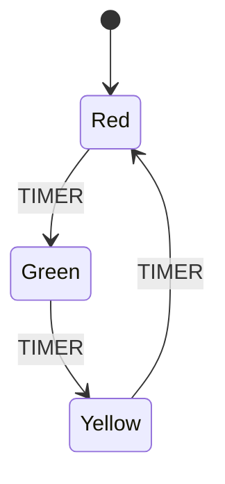

# Your First Statechart

Let's build your first statechart! We'll create a simple traffic light system that demonstrates the core concepts of states, transitions, and events.

## What We'll Build

A traffic light with three states (Red, Yellow, Green) that cycles through them based on timer events:



## Choose Your Language

<details>
<summary><strong>🐹 Go Implementation</strong></summary>

### Prerequisites

Make sure you have [Go installed](installation/go.md).

### Step 1: Create a New Project

```bash
mkdir traffic-light
cd traffic-light
go mod init traffic-light
go get github.com/tmc/sc
```

### Step 2: Create the Traffic Light

**main.go**
```go
package main

import (
    "fmt"
    pb "github.com/tmc/sc/gen/statecharts/v1"
)

func main() {
    // Step 1: Create the states
    redState := &pb.State{
        Label:     "Red",
        Type:      pb.StateType_STATE_TYPE_BASIC,
        IsInitial: true, // Start with red light
    }
    
    yellowState := &pb.State{
        Label: "Yellow", 
        Type:  pb.StateType_STATE_TYPE_BASIC,
    }
    
    greenState := &pb.State{
        Label: "Green",
        Type:  pb.StateType_STATE_TYPE_BASIC,
    }
    
    // Step 2: Create the root state to contain all traffic light states
    rootState := &pb.State{
        Label:    "__root__",
        Type:     pb.StateType_STATE_TYPE_NORMAL,
        Children: []*pb.State{redState, yellowState, greenState},
    }
    
    // Step 3: Define transitions between states
    transitions := []*pb.Transition{
        {
            Label: "RedToGreen",
            From:  []string{"Red"},
            To:    []string{"Green"},
            Event: "TIMER",
        },
        {
            Label: "GreenToYellow", 
            From:  []string{"Green"},
            To:    []string{"Yellow"},
            Event: "TIMER",
        },
        {
            Label: "YellowToRed",
            From:  []string{"Yellow"},
            To:    []string{"Red"},
            Event: "TIMER",
        },
    }
    
    // Step 4: Define the events
    events := []*pb.Event{
        {Label: "TIMER"},
    }
    
    // Step 5: Create the complete statechart
    trafficLight := &pb.Statechart{
        RootState:   rootState,
        Transitions: transitions,
        Events:      events,
    }
    
    // Step 6: Display the statechart
    fmt.Println("🚦 Traffic Light Statechart Created!")
    fmt.Printf("States: %d\n", len(rootState.Children))
    fmt.Printf("Transitions: %d\n", len(transitions))
    fmt.Printf("Events: %d\n", len(events))
    
    // Print the state hierarchy
    fmt.Println("\nState Structure:")
    for _, state := range rootState.Children {
        initial := ""
        if state.IsInitial {
            initial = " (initial)"
        }
        fmt.Printf("  - %s%s\n", state.Label, initial)
    }
    
    // Print transitions
    fmt.Println("\nTransitions:")
    for _, t := range transitions {
        fmt.Printf("  %s --[%s]--> %s\n", 
            t.From[0], t.Event, t.To[0])
    }
}
```

### Step 3: Run Your Traffic Light

```bash
go run main.go
```

Expected output:
```
🚦 Traffic Light Statechart Created!
States: 3
Transitions: 3
Events: 1

State Structure:
  - Red (initial)
  - Yellow
  - Green

Transitions:
  Red --[TIMER]--> Green
  Green --[TIMER]--> Yellow
  Yellow --[TIMER]--> Red
```

</details>

<details>
<summary><strong>🦀 Rust Implementation</strong></summary>

### Prerequisites

Make sure you have [Rust installed](installation/rust.md).

### Step 1: Create a New Project

```bash
cargo new traffic-light
cd traffic-light
```

Add to **Cargo.toml**:
```toml
[dependencies]
statecharts = { git = "https://github.com/tmc/sc", subdirectory = "sdks/rust" }
```

### Step 2: Create the Traffic Light

**src/main.rs**
```rust
use statecharts::factory::*;

fn main() {
    // Step 1: Create the states using factory functions
    let red_state = basic_state("Red", true);      // true = initial state
    let yellow_state = basic_state("Yellow", false);
    let green_state = basic_state("Green", false);
    
    // Step 2: Create the root state to contain all traffic light states  
    let root_state = normal_state(
        "__root__", 
        true, 
        vec![red_state, yellow_state, green_state]
    );
    
    // Step 3: Define transitions between states
    let red_to_green = transition(
        "RedToGreen", 
        vec!["Red"], 
        vec!["Green"], 
        "TIMER"
    );
    
    let green_to_yellow = transition(
        "GreenToYellow",
        vec!["Green"],
        vec!["Yellow"], 
        "TIMER"
    );
    
    let yellow_to_red = transition(
        "YellowToRed",
        vec!["Yellow"],
        vec!["Red"],
        "TIMER"
    );
    
    // Step 4: Define the events
    let timer_event = event("TIMER");
    
    // Step 5: Create the complete statechart
    let mut traffic_light = statechart(root_state);
    
    // Add transitions and events
    traffic_light.transitions.extend(vec![
        red_to_green, 
        green_to_yellow, 
        yellow_to_red
    ]);
    traffic_light.events.push(timer_event);
    
    // Step 6: Display the statechart
    println!("🚦 Traffic Light Statechart Created!");
    
    let root = traffic_light.root_state.as_ref().unwrap();
    println!("States: {}", root.children.len());
    println!("Transitions: {}", traffic_light.transitions.len());  
    println!("Events: {}", traffic_light.events.len());
    
    // Print the state hierarchy
    println!("\nState Structure:");
    for state in &root.children {
        let initial = if state.is_initial { " (initial)" } else { "" };
        println!("  - {}{}", state.label, initial);
    }
    
    // Print transitions
    println!("\nTransitions:");
    for t in &traffic_light.transitions {
        println!("  {} --[{}]--> {}", 
            t.from[0], t.event, t.to[0]);
    }
}
```

### Step 3: Run Your Traffic Light

```bash
cargo run
```

Expected output:
```
🚦 Traffic Light Statechart Created!
States: 3
Transitions: 3
Events: 1

State Structure:
  - Red (initial)
  - Yellow
  - Green

Transitions:
  Red --[TIMER]--> Green
  Green --[TIMER]--> Yellow
  Yellow --[TIMER]--> Red
```

</details>

## Understanding What We Built

Let's break down the key concepts:

### 1. States

We created three **basic states**:
- `Red` - The initial state (where the system starts)
- `Yellow` - An intermediate state
- `Green` - Another state in the cycle

Each state has:
- **Label**: A unique identifier ("Red", "Yellow", "Green")
- **Type**: `STATE_TYPE_BASIC` (no child states)
- **IsInitial**: Marks the starting state

### 2. Root State

The **root state** contains all our traffic light states:
- **Type**: `STATE_TYPE_NORMAL` (has child states with XOR semantics)
- **Children**: Contains our three traffic light states
- Only one child can be active at a time (XOR semantics)

### 3. Transitions

**Transitions** define how the system moves between states:
- **From**: Source state(s)
- **To**: Target state(s)  
- **Event**: What triggers the transition
- **Label**: A descriptive name

### 4. Events

**Events** are the triggers that cause state changes:
- `TIMER` - Represents a timer expiring

### 5. The Complete Statechart

A **statechart** combines all these elements:
- Root state (defines the structure)
- Transitions (defines the behavior)
- Events (defines the alphabet)

## Making It Interactive

Let's extend our traffic light to actually respond to events:

<details>
<summary><strong>🐹 Go Interactive Version</strong></summary>

**interactive.go**
```go
package main

import (
    "bufio"
    "fmt"
    "os"
    "strings"
    
    pb "github.com/tmc/sc/gen/statecharts/v1"
    "github.com/tmc/sc/semantics/v1"
)

func main() {
    // Create the same statechart as before
    statechart := createTrafficLightStatechart()
    
    // Create initial configuration (Red state active)
    config := &pb.Configuration{
        States: []*pb.StateRef{
            {Label: "__root__"},
            {Label: "Red"},
        },
    }
    
    fmt.Println("🚦 Interactive Traffic Light")
    fmt.Println("Current state:", getCurrentState(config))
    fmt.Println("Type 'timer' to advance, 'quit' to exit")
    
    scanner := bufio.NewScanner(os.Stdin)
    
    for {
        fmt.Print("> ")
        if !scanner.Scan() {
            break
        }
        
        input := strings.TrimSpace(scanner.Text())
        
        switch input {
        case "quit", "exit", "q":
            fmt.Println("Goodbye!")
            return
        case "timer", "t":
            // Process the TIMER event
            event := &pb.Event{Label: "TIMER"}
            
            // This is where you'd use semantic functions to compute next state
            // For now, we'll manually advance the state
            config = advanceTrafficLight(config)
            fmt.Println("🚥 State changed to:", getCurrentState(config))
            
        default:
            fmt.Println("Unknown command. Use 'timer' or 'quit'")
        }
    }
}

func createTrafficLightStatechart() *pb.Statechart {
    // Same creation code as before
    redState := &pb.State{
        Label:     "Red",
        Type:      pb.StateType_STATE_TYPE_BASIC,
        IsInitial: true,
    }
    
    yellowState := &pb.State{
        Label: "Yellow",
        Type:  pb.StateType_STATE_TYPE_BASIC,
    }
    
    greenState := &pb.State{
        Label: "Green",
        Type:  pb.StateType_STATE_TYPE_BASIC,
    }
    
    rootState := &pb.State{
        Label:    "__root__",
        Type:     pb.StateType_STATE_TYPE_NORMAL,
        Children: []*pb.State{redState, yellowState, greenState},
    }
    
    transitions := []*pb.Transition{
        {
            Label: "RedToGreen",
            From:  []string{"Red"},
            To:    []string{"Green"},
            Event: "TIMER",
        },
        {
            Label: "GreenToYellow",
            From:  []string{"Green"},
            To:    []string{"Yellow"},
            Event: "TIMER",
        },
        {
            Label: "YellowToRed",
            From:  []string{"Yellow"},
            To:    []string{"Red"},
            Event: "TIMER",
        },
    }
    
    events := []*pb.Event{
        {Label: "TIMER"},
    }
    
    return &pb.Statechart{
        RootState:   rootState,
        Transitions: transitions,
        Events:      events,
    }
}

func getCurrentState(config *pb.Configuration) string {
    // Find the non-root state (the actual traffic light state)
    for _, state := range config.States {
        if state.Label != "__root__" {
            return state.Label
        }
    }
    return "Unknown"
}

func advanceTrafficLight(config *pb.Configuration) *pb.Configuration {
    currentState := getCurrentState(config)
    
    var nextState string
    switch currentState {
    case "Red":
        nextState = "Green"
    case "Green":
        nextState = "Yellow"
    case "Yellow":
        nextState = "Red"
    default:
        nextState = "Red"
    }
    
    return &pb.Configuration{
        States: []*pb.StateRef{
            {Label: "__root__"},
            {Label: nextState},
        },
    }
}
```

</details>

<details>
<summary><strong>🦀 Rust Interactive Version</strong></summary>

**src/interactive.rs**
```rust
use std::io::{self, Write};
use statecharts::factory::*;
use statecharts::v1::{Configuration, StateRef};

fn main() {
    // Create the same statechart as before
    let _statechart = create_traffic_light_statechart();
    
    // Create initial configuration (Red state active)
    let mut config = Configuration {
        states: vec![
            StateRef { label: "__root__".to_string() },
            StateRef { label: "Red".to_string() },
        ],
        ..Default::default()
    };
    
    println!("🚦 Interactive Traffic Light");
    println!("Current state: {}", get_current_state(&config));
    println!("Type 'timer' to advance, 'quit' to exit");
    
    loop {
        print!("> ");
        io::stdout().flush().unwrap();
        
        let mut input = String::new();
        if io::stdin().read_line(&mut input).is_err() {
            break;
        }
        
        let input = input.trim();
        
        match input {
            "quit" | "exit" | "q" => {
                println!("Goodbye!");
                break;
            }
            "timer" | "t" => {
                // Process the TIMER event
                config = advance_traffic_light(&config);
                println!("🚥 State changed to: {}", get_current_state(&config));
            }
            _ => {
                println!("Unknown command. Use 'timer' or 'quit'");
            }
        }
    }
}

fn create_traffic_light_statechart() -> statecharts::v1::Statechart {
    // Same creation code as before
    let red_state = basic_state("Red", true);
    let yellow_state = basic_state("Yellow", false);
    let green_state = basic_state("Green", false);
    
    let root_state = normal_state(
        "__root__",
        true,
        vec![red_state, yellow_state, green_state]
    );
    
    let red_to_green = transition("RedToGreen", vec!["Red"], vec!["Green"], "TIMER");
    let green_to_yellow = transition("GreenToYellow", vec!["Green"], vec!["Yellow"], "TIMER");
    let yellow_to_red = transition("YellowToRed", vec!["Yellow"], vec!["Red"], "TIMER");
    let timer_event = event("TIMER");
    
    let mut traffic_light = statechart(root_state);
    traffic_light.transitions.extend(vec![red_to_green, green_to_yellow, yellow_to_red]);
    traffic_light.events.push(timer_event);
    
    traffic_light
}

fn get_current_state(config: &Configuration) -> &str {
    // Find the non-root state (the actual traffic light state)
    config.states.iter()
        .find(|state| state.label != "__root__")
        .map(|state| state.label.as_str())
        .unwrap_or("Unknown")
}

fn advance_traffic_light(config: &Configuration) -> Configuration {
    let current_state = get_current_state(config);
    
    let next_state = match current_state {
        "Red" => "Green",
        "Green" => "Yellow", 
        "Yellow" => "Red",
        _ => "Red",
    };
    
    Configuration {
        states: vec![
            StateRef { label: "__root__".to_string() },
            StateRef { label: next_state.to_string() },
        ],
        ..Default::default()
    }
}
```

Run with:
```bash
# Add to main.rs or create separate binary
cargo run --bin interactive
```

</details>

## Key Concepts Learned

Through building this traffic light, you've learned:

1. **State Structure**: How to organize states hierarchically
2. **State Types**: Basic states vs compound states  
3. **Transitions**: How states connect and change
4. **Events**: What triggers state changes
5. **Configuration**: Which states are currently active
6. **Initial States**: Where the system starts

## What's Next?

You've successfully created your first statechart! Here are some ways to extend it:

### 1. Add More Complexity

- **Add a pedestrian crossing button**
- **Include timing constraints**
- **Add emergency override states**

### 2. Learn Advanced Concepts

- **[Hierarchical States](../tutorials/beginner/hierarchical-states.md)** - Nest states within states
- **[Parallel States](../tutorials/beginner/parallel-states.md)** - Run multiple behaviors concurrently
- **[Guards and Actions](../tutorials/intermediate/guards-and-actions.md)** - Add conditions and side effects

### 3. Explore Real Examples

- **[User Authentication Flow](../examples/real-world/user-authentication.md)**
- **[Game State Management](../examples/real-world/game-state.md)**
- **[Order Processing System](../examples/real-world/order-processing.md)**

### 4. Dive Deeper

- **[Formal Semantics](../specifications/formal-semantics.md)** - Mathematical foundations
- **[Validation Rules](../specifications/validation-rules.md)** - Ensure correctness
- **[Performance Optimization](../tutorials/advanced/performance-optimization.md)** - Scale to large systems

## Troubleshooting

**Q: My states aren't transitioning**
**A:** Check that:
- Event names match exactly between transitions and events
- State names in transitions match state labels
- The root state has the correct type (`STATE_TYPE_NORMAL`)

**Q: I get validation errors**
**A:** Common issues:
- Root state must be labeled `"__root__"`
- Initial states must be marked with `IsInitial: true`
- Transition references must match existing state labels

**Q: The program compiles but doesn't work as expected**
**A:** Verify:
- Your initial configuration includes the correct states
- Events are being processed in the right order
- State types match their usage (basic vs compound)

---

Congratulations! You've built your first statechart. Ready to learn more? → [Basic Concepts](basic-concepts.md)