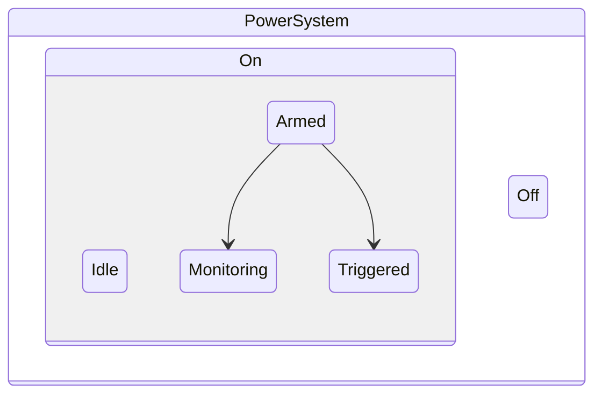
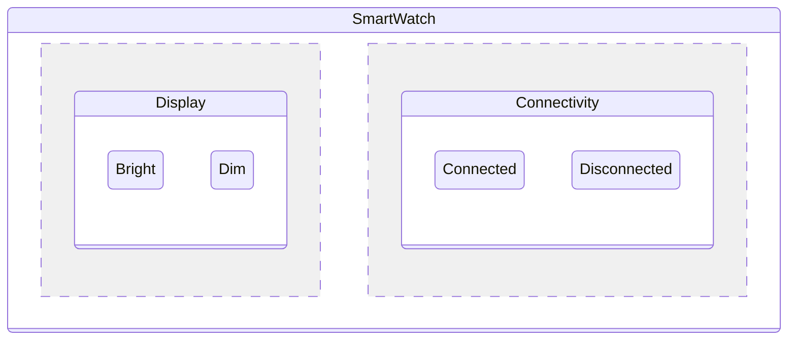
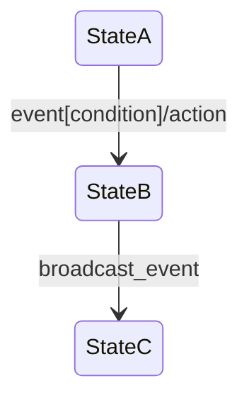

# What are Statecharts?

Statecharts are a visual formalism for specifying and designing complex reactive systems. Introduced by David Harel in 1987, they extend traditional finite state machines with powerful concepts that make them suitable for real-world applications.

## The Problem with Traditional State Machines

Traditional finite state machines (FSMs) work well for simple systems, but they quickly become unwieldy as complexity grows:

```
┌─────┐    event_a    ┌─────┐    event_b    ┌─────┐
│  A  │ ─────────────→│  B  │ ─────────────→│  C  │
└─────┘               └─────┘               └─────┘
```

As systems grow, you encounter:
- **State explosion** - Too many states to manage
- **Duplication** - Similar behaviors repeated across states  
- **Poor modularity** - Hard to compose or reuse components
- **Concurrency challenges** - Multiple independent behaviors

## How Statecharts Solve These Problems

Statecharts introduce three key extensions:

### 1. Hierarchy (Nested States)

States can contain other states, creating natural abstractions:



**Benefits:**
- Reduce state explosion through abstraction
- Inherit common behaviors from parent states
- Natural hierarchical decomposition

### 2. Orthogonality (Parallel States)

Independent behaviors can run concurrently:



**Benefits:**
- Model concurrent behaviors naturally
- Avoid cross-product state explosion
- Independent evolution of orthogonal aspects

### 3. Communication (Events & Broadcasts)

Events can trigger transitions and broadcast to other components:



**Benefits:**
- Coordinate between independent components
- Conditional transitions with guards
- Side effects through actions

## Core Concepts

### States
- **Basic State**: Has no sub-states (atomic)
- **Compound State**: Contains child states (hierarchical)
- **Orthogonal State**: Contains parallel child states (concurrent)

### Transitions
Connect states and are triggered by events:
- **Source State(s)**: Where the transition starts
- **Target State(s)**: Where the transition ends
- **Event**: What triggers the transition
- **Guard**: Optional condition that must be true
- **Actions**: Side effects executed during transition

### Events
Messages that trigger state changes:
- Can be internal (generated by the system)
- Can be external (from environment)
- Can carry data payload

### Configuration
The set of currently active states:
- In hierarchical states: includes all ancestor states
- In orthogonal states: includes all concurrent states
- Defines the complete system state

## Mathematical Foundation

Statecharts have formal semantics defined mathematically:

**Statechart Definition:**
```
S = (Q, Σ, δ, q₀, F)
```

Where:
- `Q` = finite set of states
- `Σ` = finite alphabet of events  
- `δ` = transition function
- `q₀` = initial configuration
- `F` = set of final states

**Configuration Semantics:**
- A configuration `C ⊆ Q` represents active states
- Must be consistent (respects hierarchy and orthogonality)
- Transitions transform configurations: `C₁ --e--> C₂`

## Real-World Applications

### User Interface State Management
```
Application
├── Login
│   ├── EnteringCredentials
│   └── Authenticating
└── Dashboard
    ├── Loading
    └── Ready
        ├── Sidebar (collapsed/expanded)
        └── MainContent (viewing/editing)
```

### Business Process Automation
```
OrderProcessing
├── Pending
├── Processing
│   ├── PaymentValidation
│   ├── InventoryCheck
│   └── ShippingPrep
├── Shipped
└── Delivered
```

### Device Control Systems
```
SmartThermostat
├── Power (on/off)
├── Mode (heat/cool/auto)
└── Schedule
    ├── WeekdaySchedule
    └── WeekendSchedule
```

## Benefits Over Alternatives

| Aspect | FSM | Statecharts | Redux/State Management |
|--------|-----|-------------|----------------------|
| **Hierarchy** | ❌ | ✅ Natural nesting | ⚠️ Manual composition |
| **Concurrency** | ❌ | ✅ Built-in orthogonality | ⚠️ Complex coordination |
| **Visual Modeling** | ❌ | ✅ Standard notation | ❌ |
| **Formal Semantics** | ✅ | ✅ Extended FSM theory | ❌ |
| **Tool Support** | ⚠️ | ✅ Rich ecosystem | ✅ |

## Industry Adoption

Statecharts are used in:
- **Automotive**: ECU control systems
- **Aerospace**: Flight control software  
- **Telecommunications**: Protocol implementations
- **Medical Devices**: Safety-critical systems
- **Gaming**: Complex game state management
- **Web Development**: React state management (XState)

## Next Steps

Now that you understand what statecharts are, let's get you set up:

1. **[Choose your language](installation/)** - Go or Rust installation
2. **[Build your first statechart](first-statechart.md)** - Hands-on tutorial
3. **[Learn the concepts](basic-concepts.md)** - Detailed explanations

## References

- Harel, D. (1987). "Statecharts: A visual formalism for complex systems"
- Harel, D. & Politi, M. (1998). "Modeling Reactive Systems with Statecharts"
- von der Beeck, M. (1994). "A comparison of statecharts variants"

---

Ready to install? → [Installation Guide](installation/)