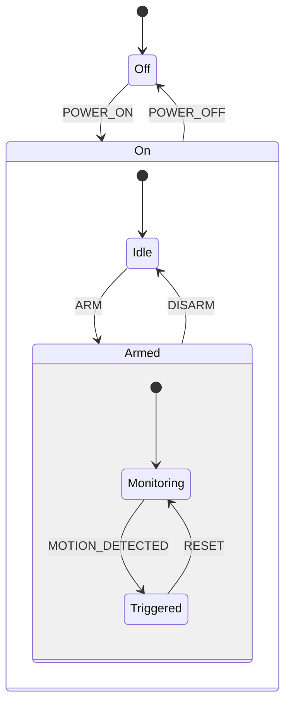
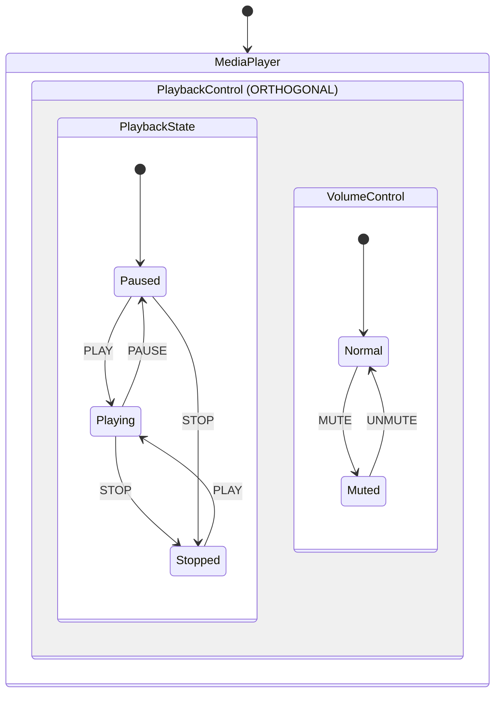
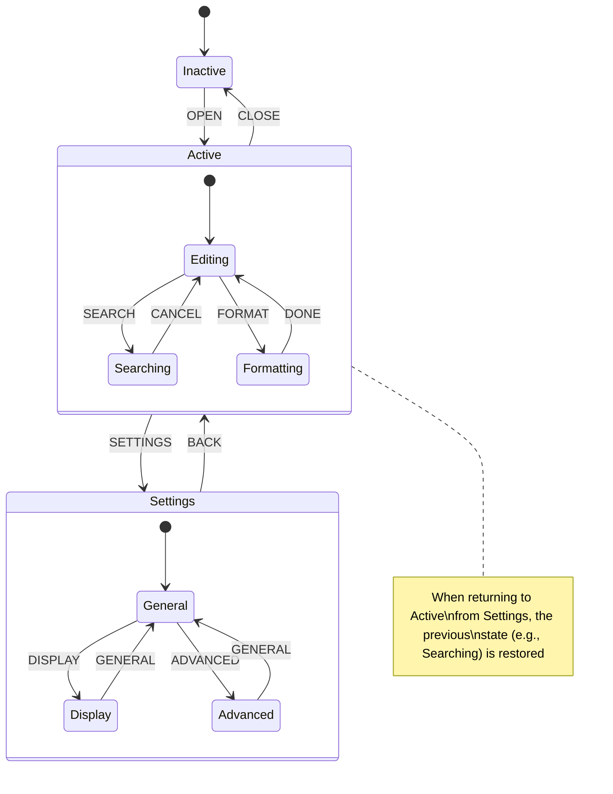
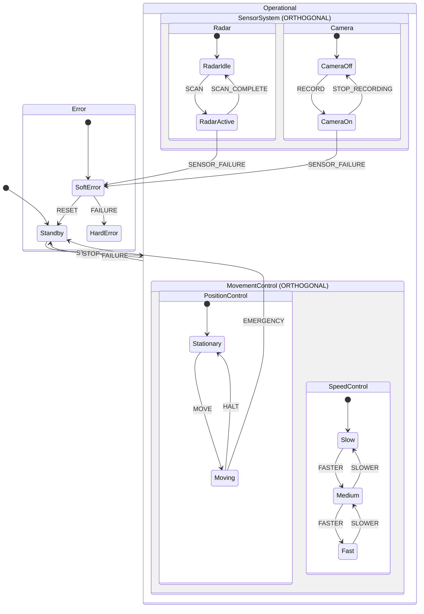

# Statecharts Academic Examples

This directory contains academic examples of statecharts based on David Harel's original formalism. These examples are designed to illustrate various aspects of statechart semantics and structure.

## Included Examples

### 1. Hierarchical Statechart

`hierarchical_statechart.go` demonstrates hierarchical state composition (OR-states), where states can contain nested substates in a hierarchical fashion. This models a simple alarm system with multiple levels of nesting.

Key features:
- Hierarchical state nesting with XOR semantics
- Default/initial state selection at each level
- Transitions between states at different hierarchical levels

#### Mermaid Diagram



<details>
<summary>XOR Semantics Explanation</summary>

The hierarchical statechart demonstrates XOR semantics, which means that when a composite state is active, exactly one of its direct substate must be active. For example:

- When `On` is active, exactly one of its substates (`Idle` or `Armed`) must be active.
- When `Armed` is active, exactly one of its substates (`Monitoring` or `Triggered`) must be active.

XOR decomposition creates a hierarchy where:

1. Child states are mutually exclusive (only one can be active at a time)
2. Transitions to a parent state implicitly target its default (initial) child state
3. Default completion semantics apply (initial states are marked with `[*]`)

The transitions in this model showcase cross-hierarchy transitions, where:
- Events can target specific nested states (e.g., `ARM` transitions from `Idle` to `Armed`)
- Default completion ensures the correct child states are activated (e.g., entering `Armed` automatically activates `Monitoring`)

</details>

### 2. Orthogonal Statechart

`orthogonal_statechart.go` demonstrates orthogonal regions (AND-states/PARALLEL/ORTHOGONAL states), where multiple regions can be active simultaneously. This models a media player with concurrent regions for playback and volume control.

Key features:
- Orthogonal regions with AND semantics
- Concurrent state configurations
- Independent transitions within orthogonal regions
- Usage of the ORTHOGONAL alias for PARALLEL states (academic terminology)

#### Mermaid Diagram



<details>
<summary>AND Semantics Explanation</summary>

The orthogonal statechart demonstrates AND semantics (also called parallel or orthogonal regions), which means that when an orthogonal state is active, all of its regions must be active simultaneously. For example:

- When `PlaybackControl` is active, both `PlaybackState` and `VolumeControl` regions are active concurrently.
- Within each region, XOR semantics still apply (e.g., only one of `Playing`, `Paused`, or `Stopped` can be active).

Key characteristics of AND decomposition:

1. Concurrency is represented through orthogonal regions
2. Events can affect multiple regions independently (e.g., `MUTE` affects only the `VolumeControl` region)
3. A valid configuration must include one active state from each orthogonal region
4. These regions execute in parallel (conceptually)

The mathematical formalism for AND states requires that all child regions be active simultaneously, which creates a product automaton with exponentially many possible configurations. For instance, this statechart has 3×2=6 possible configurations of active basic states within the `PlaybackControl` orthogonal state.

</details>

### 3. History Statechart

`history_statechart.go` demonstrates the concept of history states, which allow a statechart to "remember" previously active states. This models a text editor with history mechanism.

Key features:
- Deep history mechanism to remember previous states
- Transitions to history pseudostates
- Default history behavior

#### Mermaid Diagram



<details>
<summary>History Mechanism Explanation</summary>

History states in statecharts represent a "memory" of previously active states. Though not explicitly modeled in the diagram, the history mechanism conceptually works as follows:

1. **History Pseudostate (H)**: When a transition targets a history pseudostate, the statechart "remembers" which substate was previously active.

2. **Deep History (H*)**: Remembers the complete configuration of nested states.

3. **Default Mechanism**: If a history state has never been entered, a default transition indicates which state to enter.

In this example, when the user transitions from `Active` to `Settings` and then back to `Active`:
- Without history: `Active` would always enter the `Editing` state (its initial state)
- With history: `Active` would reenter whichever of its substates (`Editing`, `Searching`, or `Formatting`) was active before

The history mechanism implementation would require runtime state tracking by:
1. Maintaining a history variable for each composite state
2. Updating this variable whenever leaving the composite state
3. Consulting this variable when reentering via a history transition

History states are particularly useful for user interfaces where returning to previous contexts is expected behavior, such as in this text editor example when switching between editing and settings.

</details>

### 4. Compound Statechart

`compound_statechart.go` combines multiple statechart features into a complex example: hierarchical composition, orthogonality, and transitions. This models a robotic control system with multiple subsystems.

Key features:
- Hierarchical state composition (OR-states)
- Orthogonal/parallel regions (AND-states)
- Complex transitions between different hierarchy levels
- Multi-level state nesting

#### Mermaid Diagram

<details>
<summary>Expand to view the full compound statechart diagram</summary>



</details>

<details>
<summary>Complex State Configuration Explanation</summary>

The compound statechart demonstrates the power of combining hierarchical and orthogonal compositions to model complex reactive systems:

1. **Multi-level Hierarchy**:
   - `Robot` (root)
     - `Standby` (basic)
     - `Operational` (composite)
       - `MovementControl` (orthogonal)
       - `SensorSystem` (orthogonal)
     - `Error` (composite)
       - `SoftError` (basic)
       - `HardError` (basic, terminal)

2. **Orthogonal Regions**: Both `MovementControl` and `SensorSystem` contain parallel regions that operate concurrently:
   - When `MovementControl` is active, both positioning and speed control occur simultaneously
   - When `SensorSystem` is active, both radar and camera systems operate independently

3. **Cross-Hierarchy Transitions**:
   - `EMERGENCY` event causes a transition from a deeply nested state (`Moving`) directly to a top-level state (`Standby`)
   - `SENSOR_FAILURE` can originate from different regions (`RadarActive` or `CameraOn`) and target the same state (`SoftError`)

4. **Potential State Configurations**:
   The statechart has a product state space of many possible configurations. When `Operational` is active, its configuration includes:
   - One state from `PositionControl` (either `Stationary` or `Moving`)
   - One state from `SpeedControl` (either `Slow`, `Medium`, or `Fast`)
   - One state from `Radar` (either `RadarIdle` or `RadarActive`)
   - One state from `Camera` (either `CameraOff` or `CameraOn`)

   This creates 2×3×2×2=24 possible configurations just within the `Operational` state, demonstrating how statecharts efficiently represent complex state spaces with exponentially many configurations.

5. **Semantic Validation**:
   The statechart ensures critical semantic properties:
   - Consistency: Each state configuration is consistent (no conflicting XOR states)
   - Completeness: Default states are specified for each composite state
   - Reachability: All states are reachable from the initial configuration

</details>

## Academic References

These examples are based on concepts from:

1. D. Harel, "Statecharts: A Visual Formalism for Complex Systems," Science of Computer Programming, vol. 8, no. 3, pp. 231-274, 1987.

2. M. von der Beeck, "A Structured Operational Semantics for UML-Statecharts," Software and Systems Modeling, vol. 1, no. 2, pp. 130-141, 2002.

3. E. Mikk, Y. Lakhnech, M. Siegel, "Hierarchical Automata as Model for Statecharts," in Advances in Computing Science - ASIAN'97, pp. 181-196, 1997.

For formal semantics of these statechart constructs, please refer to the FORMAL_SEMANTICS.md file in the repository root.

## Implementation Notes

<details>
<summary>Formal Aspects of Statechart Implementation</summary>

Our implementation follows established formal statechart semantics:

### State Hierarchy Representation

States are represented as nodes in a tree structure, where:
- Each state has a type: Basic, Normal (OR-state), or Parallel/Orthogonal (AND-state)
- Parent-child relationships define the hierarchy
- Initial substates are marked with the `IsInitial` flag

### Transition Semantics

Transitions connect source state(s) to target state(s) and have:
- Triggering events that cause the transition to be considered
- Guards (conditional expressions) that must evaluate to true
- Actions that execute when the transition fires

Transitions follow the formal step semantics:
1. Identifying enabled transitions (triggered by the current event and with satisfied guards)
2. Conflict resolution based on priority (using state hierarchy depth)
3. Executing exit actions, transition actions, and entry actions in sequence

### Configuration Semantics

A configuration is a set of concurrently active states that must satisfy these properties:
1. The root state is always included
2. If a state is in the configuration, its parent is also in the configuration
3. If an OR-state is in the configuration, exactly one of its children is in the configuration
4. If an AND-state is in the configuration, all of its children are in the configuration

### Formal Methods

The implementation supports formal analysis methods including:
- Consistency checking (ensuring valid configurations)
- Reachability analysis (ensuring states can be reached)
- Default completion (computing the full configuration when entering a state)

</details>

## Usage Examples

<details>
<summary>Example: Using the Hierarchical Statechart</summary>

```go
// Create the hierarchical statechart
alarm := examples.HierarchicalStatechart()

// Validate the statechart
if err := alarm.Validate(); err != nil {
    log.Fatalf("Invalid statechart: %v", err)
}

// Check the default completion when entering the On state
completion, err := alarm.DefaultCompletion("On")
if err != nil {
    log.Fatalf("Error computing default completion: %v", err)
}

fmt.Println("Active states when entering On:", completion)
// Output: Active states when entering On: [On Idle]

// Check if states are ancestrally related
related, err := alarm.AncestrallyRelated("On", "Monitoring")
if err != nil {
    log.Fatalf("Error checking ancestral relation: %v", err)
}

fmt.Println("On and Monitoring are ancestrally related:", related)
// Output: On and Monitoring are ancestrally related: true
```

</details>

<details>
<summary>Example: Using the Orthogonal Statechart</summary>

```go
// Create the orthogonal statechart
mediaPlayer := examples.OrthogonalStatechart()

// Validate the statechart
if err := mediaPlayer.Validate(); err != nil {
    log.Fatalf("Invalid statechart: %v", err)
}

// Check the default completion when entering PlaybackControl
completion, err := mediaPlayer.DefaultCompletion("PlaybackControl")
if err != nil {
    log.Fatalf("Error computing default completion: %v", err)
}

fmt.Println("Active states when entering PlaybackControl:", completion)
// Output: Active states when entering PlaybackControl: [PlaybackControl PlaybackState Paused VolumeControl Normal]

// Check if states are orthogonal
orthogonal, err := mediaPlayer.Orthogonal("Paused", "Normal")
if err != nil {
    log.Fatalf("Error checking orthogonality: %v", err)
}

fmt.Println("Paused and Normal are orthogonal:", orthogonal)
// Output: Paused and Normal are orthogonal: true
```

</details>